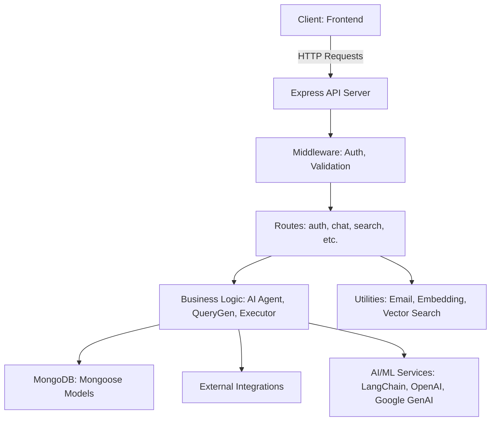
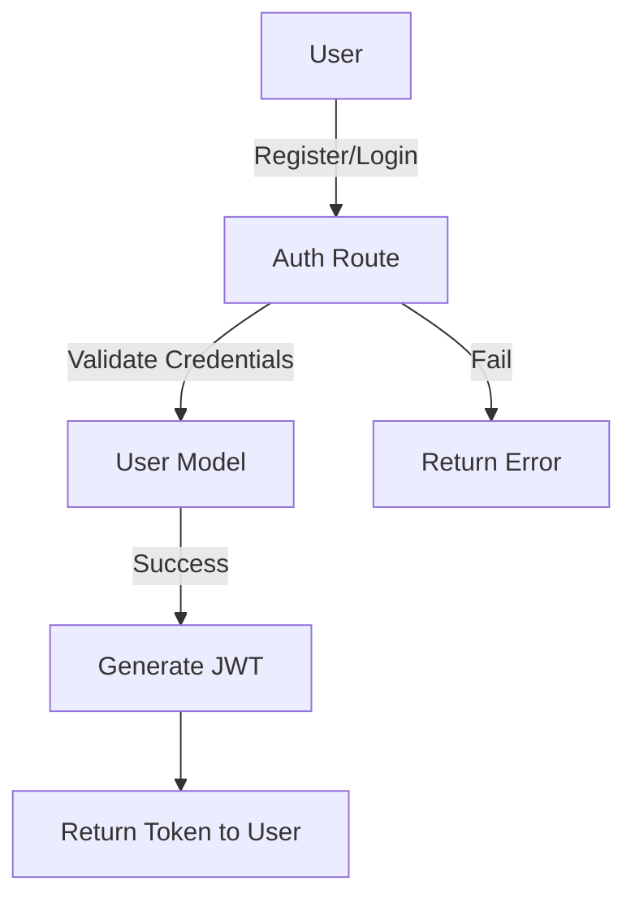
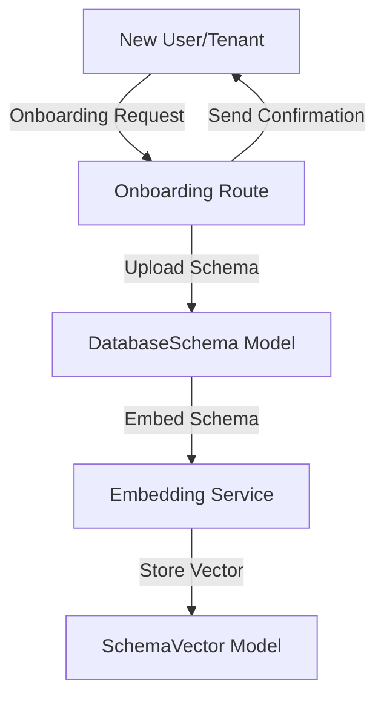
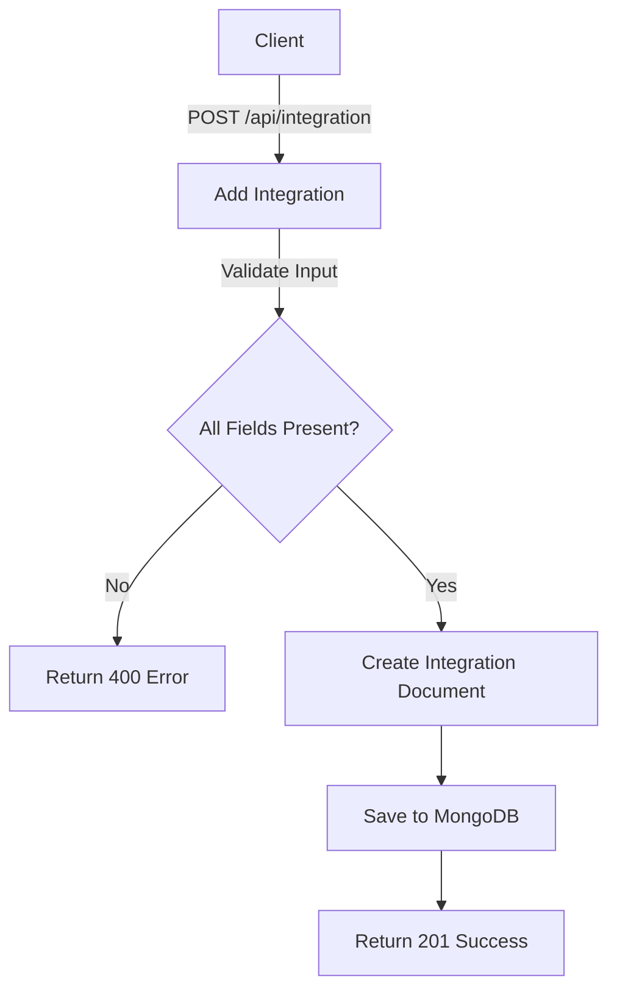
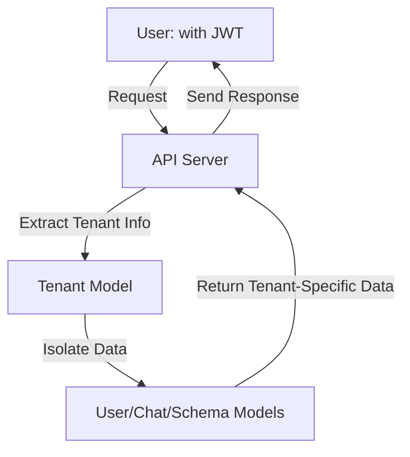

# **IntelliQuery Backend – Documentation (For Developers)**

## 1. Architecture Overview

IntelliQuery is a modular backend system built with Node.js and Express, designed for intelligent query generation, chat-based data access, and multi-tenant management. It integrates AI/ML models for natural language understanding and query generation, and uses MongoDB for persistent storage.

### Key Architectural Layers

- **API Layer**: Express routes handle HTTP requests and responses.
- **Middleware Layer**: Handles authentication, validation, and request preprocessing.
- **Business Logic Layer**: Implements core features (chat, onboarding, search, integration).
- **Data Layer**: Mongoose models interact with MongoDB.
- **AI/ML Layer**: LangChain, Google GenAI, and OpenAI power query generation and semantic search.
- **Utility Layer**: Provides supporting services (email, embeddings, vector search).

---

## 2. File & Folder Deep Dive

### Entry Point: `src/index.js`

- Loads environment variables using `dotenv`.
- Initializes Express and configures JSON and URL-encoded body parsing.
- Connects to MongoDB via `connectDB`.
- Registers all route modules under `/api/` paths.
- Starts the server and exposes a health check endpoint (`/`).

### Configuration: `src/config/db.js`

- Contains logic to connect to MongoDB using Mongoose.
- Uses environment variables for connection strings.
- Handles connection errors and logs status.

### Middleware: `src/middleware/auth.js`

- Verifies JWT tokens for protected routes.
- Attaches user information to requests for downstream handlers.
- Used in routes that require authentication (e.g., user profile, chat).

### Models: `src/models/`

Each file defines a Mongoose schema and model for a specific entity:

- **User.js**: User accounts, authentication info, roles, and profile data.
- **Tenant.js**: Organization-level data, supports multi-tenancy (isolated data per tenant).
- **Chat.js**: Stores chat sessions, messages, timestamps, and user references.
- **DatabaseSchema.js**: Represents the structure of user databases (tables, fields, types).
- **Integration.js**: Stores configuration for external service integrations (APIs, DBs).
- **QueryLog.js**: Logs every query generated and executed, including metadata (user, time, result).
- **SchemaVector.js**: Stores vector embeddings of database schemas for semantic search.

### Routes: `src/routes/`

Each route file exports an Express router with endpoints for a specific feature:

- **auth.js**: `/api/auth` – Registration, login, password reset.
- **onboarding.js**: `/api/onboarding` – Initial setup, schema upload, tenant creation.
- **integration.js**: `/api/integration` – Add, update, remove external integrations.
- **user.js**: `/api/user` – Get/update user profile, change password.
- **tenant.js**: `/api/tenant` – Tenant info, settings, user management.
- **search.js**: `/api/search` – Semantic search using vector embeddings.
- **chat.js** & **chatTest.js**: `/api/chat` – Chatbot endpoints for query generation and conversation.

### LangGraph & AI Tools: `src/langgraph/`

- **agent.js**: Orchestrates the AI agent’s workflow. Receives user input, determines intent, selects tools, and manages conversation state.
- **tools/executor.js**: Executes generated queries against the database or external sources. Handles errors and returns results.
- **tools/queryGen.js**: Uses AI models to convert natural language into database queries (SQL, MongoDB, etc.). Integrates with LangChain, Google GenAI, or OpenAI.

### Utilities: `src/utils/`

- **emailService.js**: Sends emails for onboarding, notifications, password resets using Nodemailer.
- **embeddingService.js**: Generates vector embeddings for text or schema objects using AI models.
- **mongoClient.js**: Provides helper functions for MongoDB operations.
- **vectorSearchService.js**: Performs similarity search using vector embeddings (e.g., for semantic search).

### Templates: `etc/schema.template.json`

- JSON template for database schemas.
- Used during onboarding to help users define their database structure.

---

## 3. Data Flow & Feature Workflows

### A. User Authentication

1. **Registration/Login**: User submits credentials via `/api/auth`.
2. **JWT Issuance**: On success, server issues a JWT token.
3. **Protected Routes**: Middleware checks JWT on each request, attaches user info.

### B. Onboarding

1. **Tenant Creation**: New organization is created, schema template provided.
2. **Schema Upload**: User uploads or defines their database schema.
3. **Schema Embedding**: Schema is converted to vector embeddings for semantic search.

### C. Chat & Query Generation

1. **User Input**: User sends a natural language query to `/api/chat`.
2. **Intent Detection**: `agent.js` analyzes input, determines user intent.
3. **Query Generation**: `queryGen.js` uses AI to generate a database query.
4. **Query Execution**: `executor.js` runs the query, fetches results.
5. **Response**: Results are returned to the user, and the query is logged.

### D. Semantic Search

1. **Search Request**: User submits a search query to `/api/search`.
2. **Embedding Generation**: Query is embedded into a vector.
3. **Vector Search**: `vectorSearchService.js` finds the most similar schema/data.
4. **Results**: Relevant results are returned.

### E. Integration Management

1. **Add Integration**: User configures external service via `/api/integration`.
2. **Store Config**: Integration details saved in `Integration.js`.
3. **Use Integration**: Agent can use these integrations for query execution.

### F. Multi-Tenancy

- Each tenant has isolated data, users, and configurations.
- Tenant context is managed via JWT and request data.

### G. Logging & Monitoring

- Every query and chat interaction is logged in `QueryLog.js`.
- Logs include user, tenant, query, result, and timestamp.

---

## 4. AI/ML Integration

- **LangChain**: Framework for building language model-powered agents.
- **Google GenAI & OpenAI**: Used for natural language understanding and query generation.
- **@xenova/transformers**: For embedding generation and vector search.

### Example: Query Generation Flow

1. User: “Show me all users who signed up last week.”
2. Agent:
   - Parses intent (“find users by signup date”).
   - Maps to schema (User model, signupDate field).
   - Generates query (e.g., MongoDB: `{ signupDate: { $gte: ... } }`).
   - Executes query, returns results.

---

## 5. Extending the System

- **Add New Models**: Create new schema files in `src/models/`.
- **Add New Endpoints**: Add route files in `src/routes/`.
- **Integrate New AI Models**: Update `queryGen.js` or `embeddingService.js`.
- **Add Utilities**: Place helper functions in `src/utils/`.

---

## 6. Environment & Deployment

- **Environment Variables**: Store secrets (DB URI, JWT secret) in `.env`.
- **Start Server**: Use `npm run dev` for development (auto-reload), `npm start` for production.
- **Port**: Default is 4000, configurable via `.env`.

---

## 7. Example API Usage

### Register User

```http
POST /api/auth/register
{
  "email": "user@example.com",
  "password": "securepassword"
}
```

### Chat Query

```http
POST /api/chat
{
  "message": "List all products in stock"
}
```

### Search

```http
POST /api/search
{
  "query": "recent orders"
}
```

---

## 8. Security

- **JWT Authentication**: All sensitive endpoints require a valid token.
- **Password Hashing**: User passwords are hashed using bcryptjs.
- **Input Validation**: Routes validate incoming data to prevent injection attacks.

---

## 9. Error Handling

- Centralized error handling in Express.
- Database errors, authentication failures, and AI model errors are logged and returned with appropriate status codes.

---

## 10. Summary

IntelliQuery backend is a robust, scalable, and extensible system for intelligent data access and management. It combines modern web technologies, AI/ML models, and best practices for security and multi-tenancy. Each module is designed for clarity and separation of concerns, making it easy to maintain and extend.

---

# Flowcharts and Diagrams

---

## 1. High-Level System Architecture



---

## 2. User Authentication Flow



---

## 3. Onboarding & Schema Setup



---

## 4. Integrations for External Services (e.g. Tenant DB)



---

## 5. Multi-Tenancy Data Isolation



---
